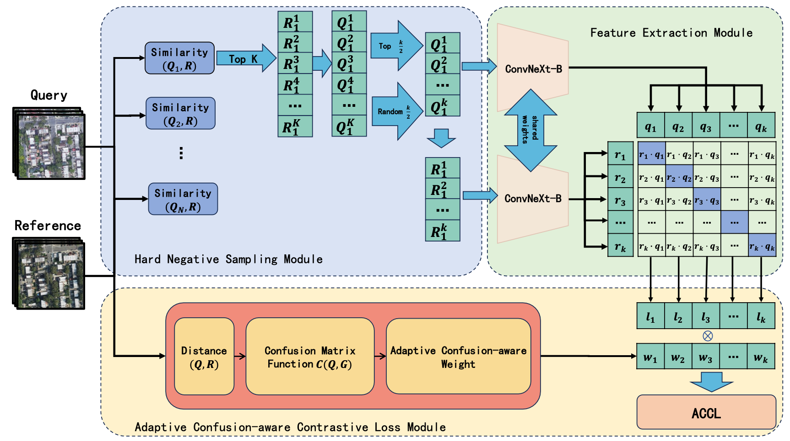

# ACCL: A Plug-and-Play Adaptive Confusion-Aware Contrastive Loss for UAV-to-Satellite

Welcome to the official repository for our ICME-accepted paper:

**"ACCL: A Plug-and-Play Adaptive Confusion-Aware Contrastive Loss for UAV-to-Satellite."**

This repository contains training and inference code for ACCL, a novel loss function designed to enhance contrastive learning by adapting to confusion in UAV-to-satellite retrieval tasks.

## Resources
- 📄 [Paper](#) (Link Coming Soon)
- 📂 [Dataset](https://github.com/NWPU-CPS/ACCL-DataSet?tab=readme-ov-file)

## ACCL Framework



> Our method consists of three core modules:
> 1. **Hard Negative Sampling Module**: Reorganizes input query images, gathering similar pairs together.
> 2. **Feature Extraction Module**: Extracts deep representations using a shared-weight neural network.
> 3. **Adaptive Confusion-Aware Contrastive Loss Module**: Computes ACCL based on extracted features and confusion measured via a confusion matrix function.

## Getting Started

### Installation
1. Clone the repository:
   ```bash
   git clone https://github.com/NWPU-CPS/ACCL.git
   cd ACCL
   ```
2. Install dependencies:
   ```bash
   pip install -r requirements.txt
   ```

### Dataset Preparation
Download and extract the datasets following the folder structure below:

### Directory Structure
```
├── ACCL
│   ├── cfgops/         # Configuration for different datasets
│   │   ├── alto/
│   │   ├── hwf/
│   │   ├── lvf/
│   │   ├── nyf/
│   │   ├── parisf/
│   ├── config/         # Defines configuration classes for data and models
│   │   ├── dconfig.py
│   │   ├── mconfig.py
│   ├── dl/             # Data loader implementation
│   │   ├── base.py
│   │   ├── hwf.py
│   ├── engine/         # Training engine
│   │   ├── trainer.py
│   ├── eval/           # Metric computation
│   ├── factory/        # Factory design pattern implementation
│   ├── misc/           # Logging utilities & common helper functions
│   ├── model/          # Model definitions
│   ├── train/          # Loss functions, schedulers, and training scripts
├── data/               # Dataset storage
│   ├── ALTO/
│   ├── NewYorkFly/
│   ├── LasV_fly/
├── figs/               # Figures for readme.md
```

### Training & Evaluation
Run the main script:
```bash
python jupiter.py
```

For each dataset, execute the corresponding configuration script. Pre-trained weights should be placed in the appropriate `cfops/` directory before running evaluation scripts.

## Citation
If you find this work useful, please consider citing our paper:
```
@inproceedings{your_citation,
  author    = {Your Name and Co-authors},
  title     = {ACCL: A Plug-and-Play Adaptive Confusion-Aware Contrastive Loss for UAV-to-Satellite},
  booktitle = {Proceedings of ICME},
  year      = {2025},
}
```

## Contact
For any questions or collaborations, feel free to open an issue or contact us.

---
Enjoy using ACCL for your research! 🚀